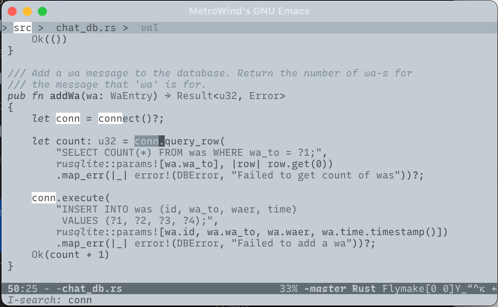

= NotInk Theme
MetroWind <chris.corsair@gmail.com>

A custom theme inspired by e-ink displays, for people who are tired of
colorful colors, and die-hard minimalinimilists.

== Installation

Copy `notink-theme.el` somewhere in your `custom-theme-load-path`, and
`(load-theme 'notink t)`.
